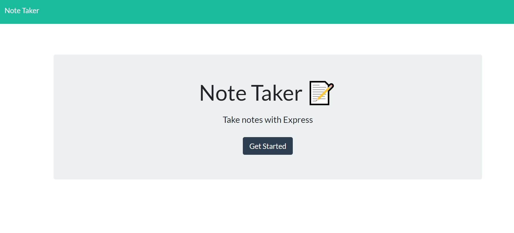
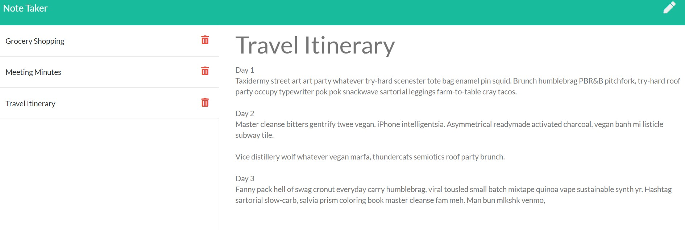

# Note-Taker-Organizer
Express application to create a note or task taking

Eclipse 

## About this application:
`Express.js` backend development to create a note taker application where the user can create or delete notes.

## Table of contents:
* [Team Profile Generator](#team-profile-generator)
* [About](#about-this-application)
* [Usage](#usage)
* [Installation](#installation)
* [License](#license)
* [Testing](#special-testing-instructions)
* [In case of Questions](#in-case-of-questions)
* [Link Heroku Deployment](#link-to-heroku-app-deployment)

## Usage:
    This `Express.js` application can be used by any one who would like to save time and keep themselves well organized by creating, editing and deleting notes.
    This application will use Heroku to be deployed, the user will be presented with a landing page and will be taken to the secondary page where notes can be saved, edited and/or deleted.
    All notes can be saved a JSON file (contained on the App) and they will be displayed next time the page is loaded. this application has been deployed to Heroku.
---
- Here it is an example of the questions prompted when the application is started with a list of the three categories:
    

- Example of deployed list.
    

---
## Installation:
After cloning the repository a new folder called `Develop` will be created; this folder contains the package json and the all the utilities needed to run the `server.js` script file.

To run this application locally please run `nmp install` to load all the packages from the provided `package.json` file before running the command `node server.js`

## License
I have used the Eclipse 2.0 license for this application see repository documentation 
<https://github.com/Rodolfod1/Note-Taker-Organizer/blob/main/LICENSE>

## Testing
This can be manually tested or using any test tool

## Link To Heroku app deployment:
  
<https://mynote-taker-express.herokuapp.com>

## In case of questions:
Please contact me at my e-mail: 
rodolfodzr@gmail.com

Follow me on Github
<https://github.com/Rodolfod1>

